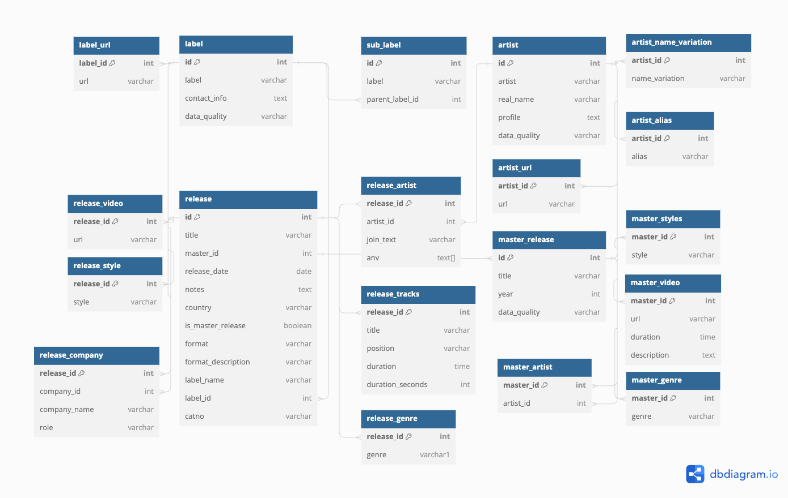

# Discogs Ingest
Discogs Ingest is a Python program that extracts the most recent Discogs data dump, parses the XML files, and allows for exporting to CSV and DuckDB.

## Installation
1. Clone the repository:
```
git clone https://github.com/justinpakzad/discogs-ingest
```
2. Create a virtual enviornment:
```
pyenv virtualenv 3.10.6 discogs_ingest
pyenv activate discogs_ingest
```
3. Install required dependencies:
```cd discogs_ingest
pip install -r requirements.txt
```

## CSV Export Usage
**Command Line Arguments:**
- `--dir`: Directory for saving output files. If the directory does not exist, it will be created (required).  
- `--raw_dir`: Directory where the raw data dumps live (not needed if using `--download`).  
- `--sample`: Extracts a sample of 50k to CSV (optional).
- `--download`: Downloads the latest Discogs data dumps (optional).  


**Csv Example:**
```
python main.py --dir <download_dir> --download  
``` 
## DuckDB Export Usage
The CSV files must be downloaded in order to make use of the DuckDB exporter.  

**Command Line Arguments:** 
- `--db`: Path where database will be saved.
- `--csvs`: Path where CSV files are located.

**DuckDB Example**
```
python duck_db.py --db <db_path> --csvs <csv_path>
```  
## Data Model


